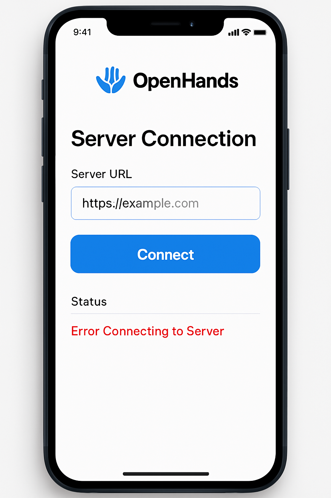
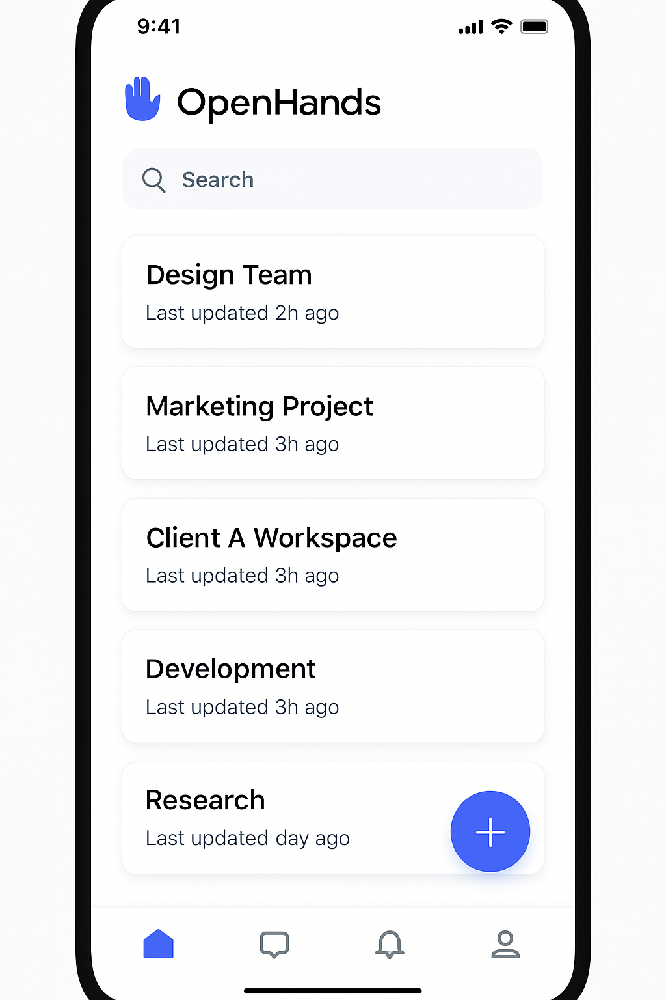
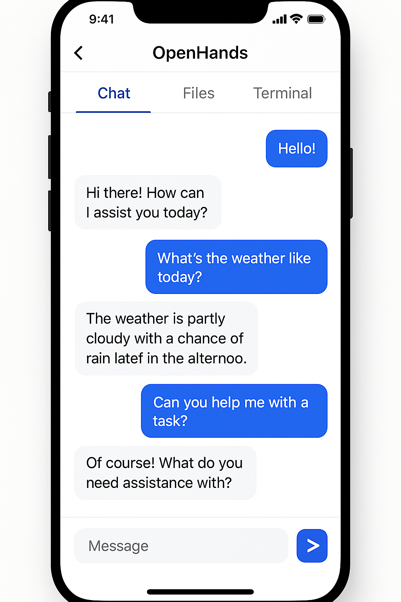
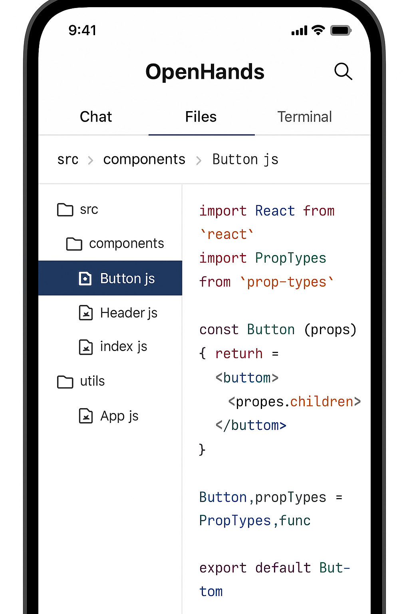
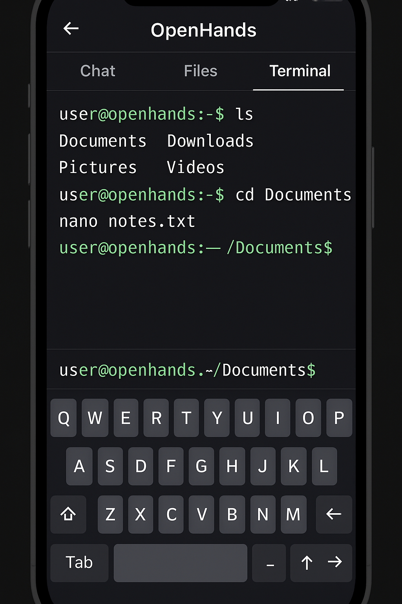
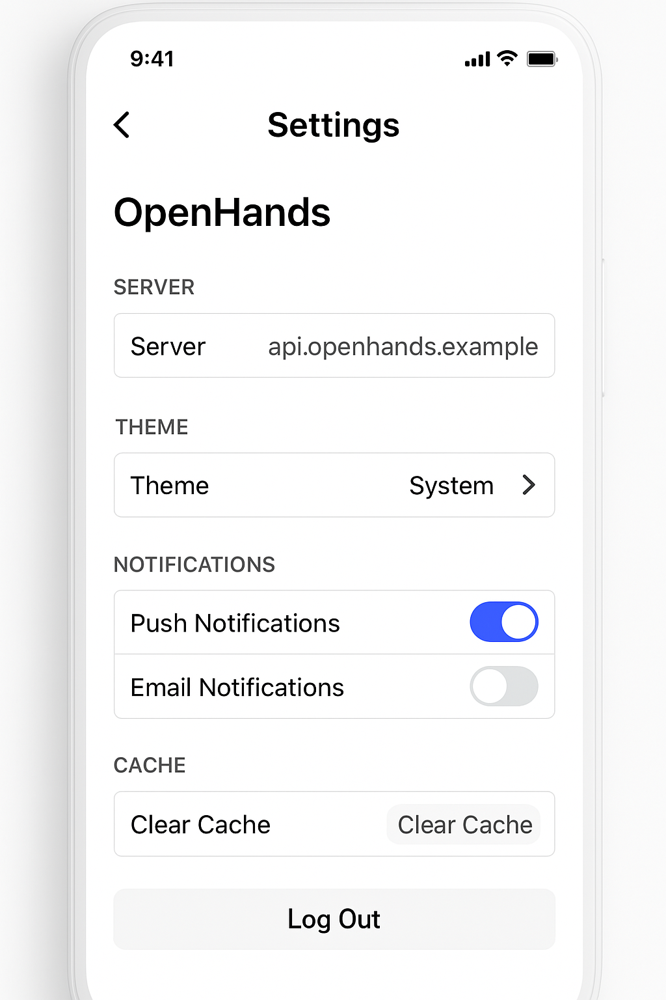

# OpenHands モバイルアプリ UI/UX プロトタイプ設計

## 1. デザイン原則

### 1.1 デザインの一貫性
- 既存のOpenHandsウェブアプリのデザイン言語を踏襲
- モバイル向けに最適化しつつ、ブランドの一貫性を維持

### 1.2 モバイル最適化
- タッチインタラクションを優先
- 片手操作を考慮したUI配置
- スクリーンサイズに応じた適応型レイアウト

### 1.3 アクセシビリティ
- 十分なコントラスト比
- タップ領域の適切なサイズ確保
- スクリーンリーダー対応

## 2. カラーパレット

既存のOpenHandsウェブアプリに合わせたカラーパレット：

- **プライマリカラー**: #3B82F6 (青)
- **セカンダリカラー**: #10B981 (緑)
- **アクセントカラー**: #6366F1 (紫)
- **背景色**: #FFFFFF (白) / #F3F4F6 (薄いグレー)
- **テキスト色**: #111827 (濃いグレー) / #6B7280 (中間グレー)
- **エラー色**: #EF4444 (赤)
- **警告色**: #F59E0B (オレンジ)
- **成功色**: #10B981 (緑)

## 3. タイポグラフィ

- **フォントファミリー**: System font (San Francisco on iOS, Roboto on Android)
- **見出し (H1)**: 24px, Bold
- **見出し (H2)**: 20px, Bold
- **見出し (H3)**: 18px, SemiBold
- **本文**: 16px, Regular
- **小テキスト**: 14px, Regular
- **最小テキスト**: 12px, Regular

## 4. 画面設計

### 4.1 サーバー接続画面



**主要要素**:
- サーバーURL入力フィールド
- 接続ステータス表示
- 接続ボタン
- エラーメッセージ表示領域
- 設定オプション（詳細設定）

**インタラクション**:
- URLを入力して接続ボタンをタップ
- 接続成功時はホーム画面に自動遷移
- 接続失敗時はエラーメッセージを表示

### 4.2 ホーム画面



**主要要素**:
- 既存のWorkspace一覧（カード形式）
- 新規Workspace作成ボタン
- 各Workspaceの最終更新日時
- 検索バー
- ナビゲーションバー

**インタラクション**:
- Workspaceカードをタップして詳細画面に遷移
- 長押しでWorkspaceの削除/名前変更などのオプション表示
- 下にスワイプして一覧を更新

### 4.3 会話画面



**主要要素**:
- チャットメッセージ表示領域
- メッセージ入力フィールド
- 送信ボタン
- 添付ファイルボタン
- ワークスペース情報表示
- ナビゲーションバー（ファイル閲覧・ターミナルへの切り替え）

**インタラクション**:
- メッセージを入力して送信
- 画像添付機能
- メッセージの長押しでコピー/引用などのオプション
- 上にスクロールで過去のメッセージを読み込み

### 4.4 ファイル閲覧画面



**主要要素**:
- ファイルツリービュー
- ファイル内容表示領域（コードエディタ）
- シンタックスハイライト
- 検索機能
- ナビゲーションバー

**インタラクション**:
- ファイルをタップして内容を表示
- フォルダをタップして展開/折りたたみ
- ピンチイン/アウトでズーム
- 横スワイプでタブ切り替え（複数ファイルを開いている場合）

### 4.5 ターミナル画面



**主要要素**:
- ターミナル出力表示領域
- コマンド入力フィールド
- カスタムキーボード（特殊キー用）
- よく使うコマンドのクイックアクセスボタン
- ナビゲーションバー

**インタラクション**:
- コマンド入力と実行
- 上下スワイプで出力履歴のスクロール
- 左右スワイプでカーソル移動
- カスタムキーボードで特殊キー入力（Tab, Ctrl, Alt等）

### 4.6 設定画面



**主要要素**:
- サーバー設定
- テーマ設定
- 通知設定
- キャッシュ管理
- アプリ情報
- ログアウトボタン

**インタラクション**:
- 各設定項目をタップして詳細設定
- トグルスイッチでオン/オフ切り替え
- スライダーで数値調整

## 5. ナビゲーション構造

```
App
├── サーバー接続画面
│   └── ホーム画面
│       ├── 新規Workspace作成
│       └── Workspace詳細
│           ├── 会話画面
│           ├── ファイル閲覧画面
│           └── ターミナル画面
└── 設定画面
```

**ナビゲーションパターン**:
- タブナビゲーション: メイン機能間の切り替え（会話・ファイル・ターミナル）
- スタックナビゲーション: 画面の階層構造
- ドロワーナビゲーション: 設定やその他のオプション

## 6. レスポンシブデザイン戦略

- **スマートフォン（小）**: 単一カラムレイアウト、要素を縦に配置
- **スマートフォン（大）**: 単一カラムレイアウト、余白を調整
- **タブレット（縦）**: 2カラムレイアウト（一部画面）
- **タブレット（横）**: マルチパネルレイアウト（会話+ファイル閲覧など）

## 7. アニメーションとトランジション

- 画面遷移: スライドトランジション
- リスト項目: フェードイン/アウト
- ボタン: スケールアニメーション（タップ時）
- ローディング: スピナーまたはスケルトンUI

## 8. ユーザーフロー

### 8.1 初回起動フロー
1. アプリ起動
2. サーバー接続画面表示
3. サーバーURL入力
4. 接続成功
5. ホーム画面表示

### 8.2 新規Workspace作成フロー
1. ホーム画面から「新規作成」ボタンタップ
2. Workspace名入力
3. 作成確認
4. 会話画面表示

### 8.3 ファイル閲覧フロー
1. 会話画面からファイルタブに切り替え
2. ファイルツリーからファイル選択
3. ファイル内容表示
4. 必要に応じてズームや検索

### 8.4 ターミナル操作フロー
1. 会話画面からターミナルタブに切り替え
2. コマンド入力
3. 実行結果確認
4. 必要に応じてスクロールや履歴参照

## 9. アクセシビリティ対応

- スクリーンリーダー対応のためのセマンティックラベル
- 十分なコントラスト比の確保
- タップ領域の最小サイズ: 44x44ポイント
- キーボードナビゲーション対応（外部キーボード使用時）
- ダイナミックタイプ（フォントサイズ変更）対応

## 10. 次のステップ

- 高忠実度プロトタイプの作成
- ユーザーテスト実施
- フィードバックに基づく改善
- 実装仕様書への変換
